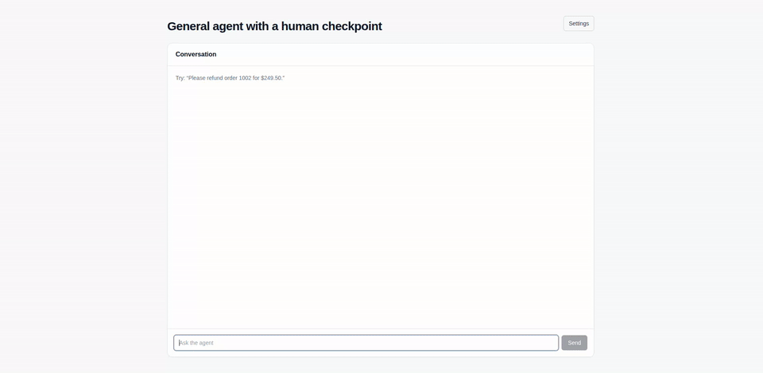
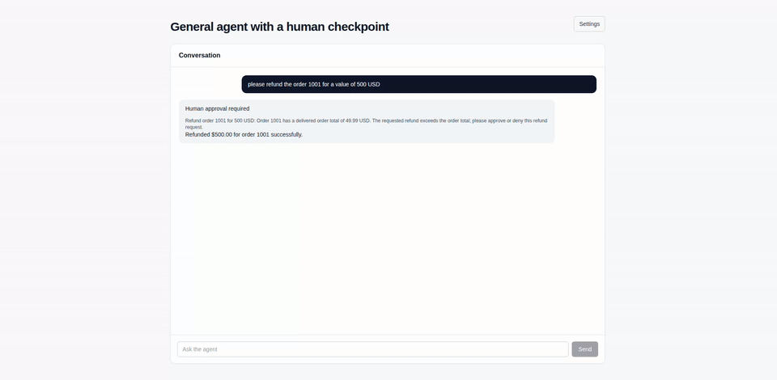

# General Agent

A minimal Next.js general agent powered by WorkflowDevKit's `DurableAgent`. The agent follows editable plain-text instructions and pauses durable execution when a refund, high-value action, or ambiguous request needs human approval. Approval can arrive from Slack or the in-app fallback.

## Demo

### Settings


### Example refusal 1



### Example refusal 2



## Run locally

Prerequisites: Node.js 24 and npm.

```bash
make run
```

The first run prompts for the required credentials and writes them to `.env`. Later runs skip the prompt when all required values are present.

For development without the prompt, create `.env` from `.env.example` and run `npm run dev`.

## Environment variables

| Variable | Required | Description |
|---|---:|---|
| `OPENROUTER_API_KEY` | yes | Server-side OpenRouter API key. |
| `SLACK_BOT_TOKEN` | yes | Slack bot token, usually `xoxb-...`. |
| `SLACK_SIGNING_SECRET` | yes | Slack app signing secret. |
| `SLACK_APPROVAL_CHANNEL_ID` | yes | Channel where approval messages are posted. |
| `APPROVAL_TIMEOUT_MS` | no | Approval timeout, default `86400000` (24 hours). |
| `APP_URL` | no | Referer sent to OpenRouter, default `http://localhost:3000`. |

## Slack setup

1. Create an app at [api.slack.com/apps](https://api.slack.com/apps) from scratch.
2. Add bot token scopes `chat:write`, `chat:write.public`, `channels:history`, and `groups:history`.
3. Enable Interactivity and set the Request URL to `https://<your-domain>/api/slack/interactions`.
4. Install the app and copy the bot token and signing secret into `.env`.
5. Invite the bot to the approval channel and set its channel ID in `.env`.

The interaction endpoint verifies Slack's HMAC signature and rejects requests older than five minutes.

## Deploy

Deploy the repository as a Next.js app on Vercel and add the same environment variables in the project settings. Set the Slack Interactivity Request URL to the deployed `/api/slack/interactions` endpoint.
